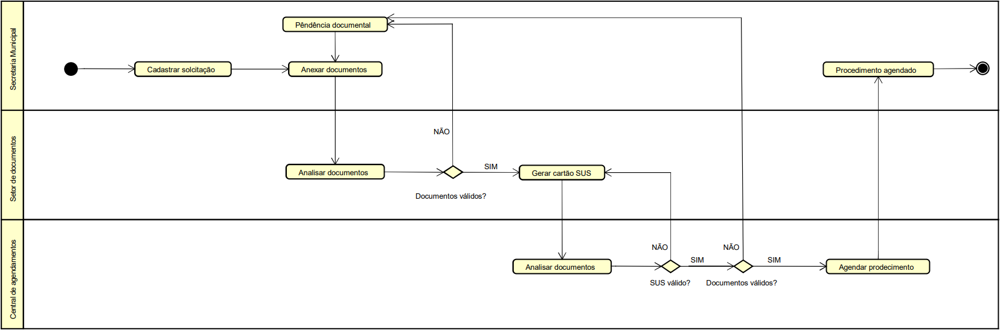

# Agendamento de procedimentos

<details open="open">
  <summary>Sumário</summary>
  <ol>
    <li>
      <a href="#sobre-o-projeto">Sobre o projeto</a>
      <ul>
        <li><a href="#tecnologias-utilizadas">Tecnologias utilizadas</a></li>
      </ul>
    </li>
    <li>
      <a href="#getting-started">Getting Started</a>
      <ul>
        <li><a href="#instalação">Instalação</a></li>
        <li><a href="#preparando-ambiente">Preparando o ambiente</a></li>
      </ul>
    </li>
    <li><a href="#documentação">Documentação</a></li>
    <li><a href="#license">License</a></li>
    <li><a href="#contato">Contato</a></li>
  </ol>
</details>

## Sobre o projeto

  O sistema auxilia o proocesso de encaminhamentos para procedimentos oftamológicos solicitados durantes os multirões do Insituto Mais Visão. Com a utilização do mesmo o fluxo de trabalho passa a ser digitalizado de forma a aumentar a eficência e reduzir o tempo de agendamento dos procedimentos.

## Tecnologias utilizadas

- [Laravel](https://laravel.com/)
- [Bootstrap](https://getbootstrap.com/)

## Getting Started

Para obter uma copia local do repositório siga os passos a seguir. Será necessário instalar os seguintes serviços em seu ambiente de desenvolvimento: `PHP 7.3`, `MySQL` and `npm`.

### Instalação

1. Clone o repositório
   ```sh
   git clone https://github.com/costajvsc/ngo-institutomaisvisao.git
   ```

2. Instale os pacotes necessários

* composer
  ```
    composer install
  ```
* npm
  ```
    npm install
  ```

### Preparando ambiente

1. Crie o arquivo de configuração `.env` . Você pode copiar e modificar o arquivo `.env.example` para completar esse passo.

2. Migrando o banco de dados
   ```shell
   php artisan migrate
   ```
3. Rodando a aplicação
   ```
   php artisan serve
   ```

## Documentação

### Caso de uso


**Atores**
- Secretaria municipal
- Setor de documentos
- Central de agendamentos

### Diagrama de classe


### Diagrama atividades


**Etapas**
1. Solicitação enviada (_Secretaria municipal_)
   - Anexar documentos digitalizados

2. Trocar cartão SUS (_Setor de documentos_)
  - Troca do nº do cartão SUS
  - Endereço de Salvador (BA)
  - Anexar novo nº do cartão

3. Agendar procedimento (_Central de agendamento_)
  - Informar local, data e hora do procedimento
  - Anexar nº da senha do procedimenrto 
  - Notificar a _Secretaria municipal_

## Contato

João Victor - [LinkedIn](https://www.linkedin.com/in/victor-costa-jvsc/) - costa.jvsc@gmail.com

Project Link: [https://github.com/costajvsc/ngo-institutomaisvisao](https://github.com/costajvsc/ngo-institutomaisvisao)
